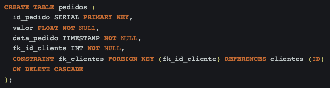

# Banco de Dados II - Desafio 1 Code Park 2

## INSTRUÇÕES DO PROJETO

Crie um banco de dados, adicione tabelas e determine quais são os atributos de cada uma. Em seguida, execute um trigger que se relacione com algum comando, como insert, select, delete ou update.

Trabalhe esse código em seu IDE, suba ele para sua conta no GitHub e compartilhe o link desse projeto no campo ao lado para que outros desenvolvedores possam analisá-lo.

## Resolução

### Imagem de um banco de dados real

O objetivo da trigger é emitir um aviso quando uma nova linha for inserida na tabela.

